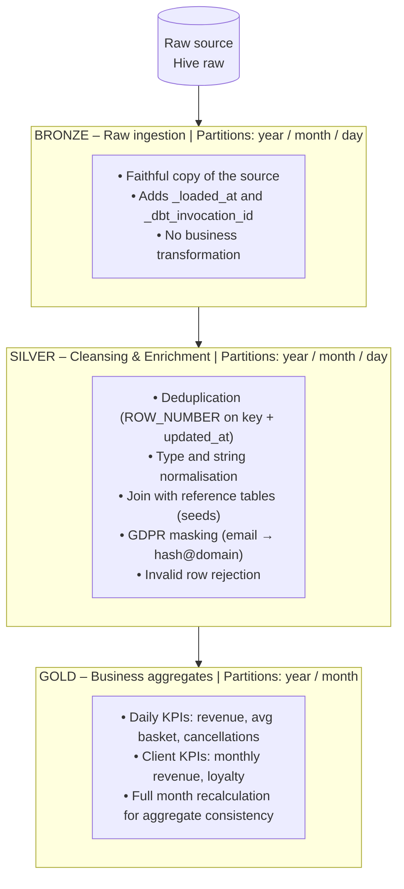
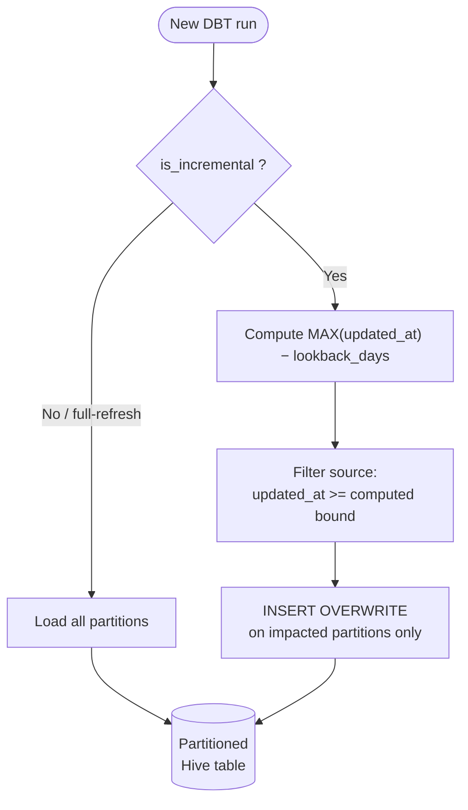
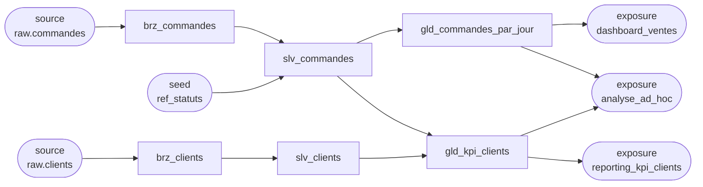

# DBT Sandbox – Hive Medallion Architecture

A DBT sandbox project designed for data pipelines on **Apache Hive SQL**, featuring a medallion architecture (Bronze → Silver → Gold) with **incremental partition-based updates** by year/month/day of modification.

---

## Table of contents

- [Overview](#overview)
- [Medallion architecture](#medallion-architecture)
- [Incremental mechanics](#incremental-mechanics)
- [Project structure](#project-structure)
- [Reusable Jinja macros](#reusable-jinja-macros)
- [Prerequisites](#prerequisites)
- [Installation](#installation)
- [Configuration](#configuration)
- [Usage](#usage)
- [Tests](#tests)
- [Generated documentation](#generated-documentation)

---

## Overview

This sandbox demonstrates DBT best practices for a production Hive cluster:

| Common problem | Solution |
|---|---|
| Full scan on every run | Partition filtering on `annee/mois/jour` |
| Duplicates at ingestion | `deduplicate()` macro in Silver |
| Late-arriving data | Configurable lookback window (`incremental_lookback_days`) |
| Schema names per environment | `generate_schema_name()` override → `dev_sandbox_bronze`, `prod_sandbox_gold` |
| Repetitive incremental logic | Centralised `incremental_partition_predicate()` macro |

The project relies on **dbt-hive** (official ThriftServer adapter) and uses the **Parquet** format for all materialised tables.

---

## Medallion architecture



### Models by layer

| Layer | Model | Description |
|---|---|---|
| Bronze | `brz_commandes` | Raw orders stream |
| Bronze | `brz_clients` | Raw client reference |
| Silver | `slv_commandes` | Cleaned and enriched orders |
| Silver | `slv_clients` | Normalised clients with masked email |
| Gold | `gld_commandes_par_jour` | Daily revenue, volume and cancellation rate |
| Gold | `gld_kpi_clients` | Monthly client KPIs |

---

## Incremental mechanics

### `insert_overwrite` strategy (Hive)

Hive does not support `MERGE`. The strategy used is **`insert_overwrite`**: DBT identifies impacted partitions and rewrites them entirely.



### Partition filter

The `incremental_partition_predicate()` macro automatically generates the right predicate:

```sql
-- Incremental mode: filter on updated_at since last known MAX
WHERE updated_at >= (
  SELECT COALESCE(MAX(updated_at), '1900-01-01') - INTERVAL 3 DAYS
  FROM <this>
)

-- Full refresh mode: no filter (1=1)
WHERE 1=1
```

### Lookback window

The `incremental_lookback_days` variable (default: `3`) re-reads the last N days even if already loaded. This absorbs late-arriving updates and source corrections.

```yaml
# dbt_project.yml
vars:
  incremental_lookback_days: 3
```

To force a full recalculation of a model:

```bash
dbt run --select brz_commandes --full-refresh
```

---

## Project structure

```
DBT-sandbox/
├── dbt_project.yml                  # Central project configuration
├── profiles.yml                     # Hive connections (gitignored)
├── packages.yml                     # Dependencies (dbt_utils)
├── requirements.txt                 # dbt-core + dbt-hive
│
├── macros/
│   ├── incremental_utils.sql        # Incremental and partition macros
│   ├── hive_utils.sql               # Hive utilities (dedup, normalisation)
│   └── schema_utils.sql             # Schema name generation
│
├── models/
│   ├── bronze/
│   │   ├── _sources.yml             # Raw source table declarations
│   │   ├── _schema.yml              # Bronze tests
│   │   ├── brz_commandes.sql
│   │   └── brz_clients.sql
│   ├── silver/
│   │   ├── _schema.yml              # Silver tests
│   │   ├── slv_commandes.sql
│   │   └── slv_clients.sql
│   └── gold/
│       ├── _schema.yml              # Gold tests
│       ├── gld_commandes_par_jour.sql
│       └── gld_kpi_clients.sql
│
├── seeds/
│   └── ref_statuts_commande.csv     # Status reference (EN_COURS, VALIDE…)
│
├── analyses/
│   └── exploration_incremental.sql  # Verification queries (dbt compile)
│
└── tests/
    └── generic/
        └── test_partition_non_vide.sql
```

---

## Reusable Jinja macros

### `incremental_utils.sql`

| Macro | Description |
|---|---|
| `get_max_timestamp(column)` | Returns MAX timestamp of the target table, with lookback |
| `incremental_partition_predicate(ts_column)` | Generates the WHERE clause to filter impacted partitions |
| `date_partition_cols(ts_column)` | Generates `annee`, `mois`, `jour` columns from a timestamp |
| `month_partition_cols(ts_column)` | Generates `annee`, `mois` columns (Gold) |
| `load_affected_business_partitions(source, ts_col, date_col)` | Silver pattern: reloads full business-date partitions affected by recent updates |

### `hive_utils.sql`

| Macro | Description |
|---|---|
| `deduplicate(relation, unique_key, order_col)` | ROW_NUMBER on key + DESC timestamp sort |
| `normalize_string(col)` | `UPPER(TRIM(col))` |
| `hive_tblproperties()` | TBLPROPERTIES with dbt metadata |

### `schema_utils.sql`

| Macro | Description |
|---|---|
| `generate_schema_name(custom_schema, node)` | dbt override: generates `<target_schema>_<layer>` |

**Example usage in a Silver model:**

```sql
{{ config(
    materialized        = 'incremental',
    incremental_strategy= 'insert_overwrite',
    partition_by        = ['annee', 'mois', 'jour']
) }}

WITH source AS (
  SELECT * FROM {{ ref('brz_commandes') }}
  WHERE {{ incremental_partition_predicate('updated_at') }}
),
dedup AS (
  {{ deduplicate('source', ['id_commande'], 'updated_at') }}
)
SELECT *, {{ date_partition_cols('updated_at') }}
FROM dedup
```

---

## Prerequisites

- Python >= 3.9
- Access to a Hive cluster with HiveServer2 (Thrift or HTTP)
- Environment variables depending on the chosen authentication method (see [Configuration](#configuration))

---

## Installation

```bash
# 1. Clone the repo
git clone <repo-url>
cd DBT-sandbox

# 2. Create a virtual environment
python -m venv .venv
source .venv/bin/activate       # Windows: .venv\Scripts\activate

# 3. Install Python dependencies
pip install -r requirements.txt

# 4. Copy and fill in the connection profile
cp profiles.example.yml ~/.dbt/profiles.yml
# Edit ~/.dbt/profiles.yml with your Hive parameters

# 5. Install dbt packages
dbt deps

# 6. Verify the connection
dbt debug
```

---

## Configuration

Two authentication methods are available in `profiles.yml`.

### Method 1 – Thrift (user/password or LDAP)

```bash
export HIVE_HOST=hiveserver2.mycluster.local
export HIVE_PORT=10000
export HIVE_USER=my_user
# export HIVE_PASSWORD=...   # uncomment if LDAP/PAM is enabled on the cluster
```

### Method 2 – Kerberos

> `username` is **not** used: identity is carried by the Kerberos TGT ticket.

```bash
export HIVE_HOST=hiveserver2.mycluster.local
export HIVE_PORT=10000
export HIVE_KRB5_SERVICE=hive
export HIVE_KRB5_PRINCIPAL=hive/hiveserver2.mycluster.local@REALM.LOCAL

# Obtain a ticket before running dbt
kinit my_principal@REALM.LOCAL
```

### Available targets (`profiles.yml`)

| Target | Auth | Hive schema | Threads | Usage |
|---|---|---|---|---|
| `dev` | Thrift | `dev_sandbox_*` | 4 | Local development |
| `prod` | Thrift | `prod_sandbox_*` | 8 | Production |
| `dev_kerberos` | Kerberos | `dev_sandbox_*` | 4 | Development on secured cluster |
| `prod_kerberos` | Kerberos | `prod_sandbox_*` | 8 | Production on secured cluster |

```bash
# default thrift dev target
dbt run

# kerberos dev target
dbt run --target dev_kerberos

# kerberos prod target
dbt run --target prod_kerberos
```

### Adapting sources

Edit `models/bronze/_sources.yml` to point to the actual Hive tables:

```yaml
sources:
  - name: raw
    database: my_raw_db     # ← actual Hive database name
    schema: my_raw_db
    tables:
      - name: commandes     # ← actual table name
```

---

## Usage

### Essential commands

```bash
# Load reference tables (seeds)
dbt seed

# Run all models incrementally
dbt run

# Run a single layer
dbt run --select tag:bronze
dbt run --select tag:silver
dbt run --select tag:gold

# Run a specific model and all its upstream dependencies
dbt run --select +slv_commandes

# Force full recalculation of a model
dbt run --select brz_commandes --full-refresh

# Force full recalculation of the entire chain
dbt run --full-refresh

# Compile analyses without executing (useful for Beeline)
dbt compile --select exploration_incremental
# → SQL available in target/compiled/dbt_sandbox/analyses/
```

### Typical daily run workflow

```bash
# 1. Seeds (if reference data changed)
dbt seed --select ref_statuts_commande

# 2. Bronze → Silver → Gold in sequence
dbt run --select tag:bronze
dbt run --select tag:silver
dbt run --select tag:gold

# 3. Tests
dbt test

# Or all in one command
dbt build
```

### Adjusting the lookback window on the fly

```bash
# Re-read the last 7 days instead of 3
dbt run --vars '{"incremental_lookback_days": 7}'
```

---

## Tests

```bash
# Run all tests
dbt test

# Tests for a single layer
dbt test --select tag:silver

# Tests + run in one command
dbt build
```

### Included tests

| Layer | Model | Tests |
|---|---|---|
| Bronze | `brz_commandes` | `not_null` on `id_commande`, `updated_at`, partition columns |
| Bronze | `brz_clients` | `not_null` on `id_client`, `updated_at` |
| Silver | `slv_commandes` | `not_null` on key columns + `cles_orphelines` + `taux_rejet_max` |
| Silver | `slv_clients` | `not_null` on `id_client` + `cles_orphelines` + `taux_rejet_max` |
| Gold | `gld_commandes_par_jour` | `not_null` + `unique` on `date_commande` + `couverture_agregat` |
| Gold | `gld_kpi_clients` | `not_null` on `id_client`, `date_reference` |

> **Note on Silver uniqueness:** `id_commande` is unique *within* each `updated_at`
> partition but not globally. Silver is multi-version by design — inter-partition
> deduplication is handled in Gold via `deduplicate()`.

The generic `test_partition_non_vide` test can be added to any `_schema.yml`:

```yaml
models:
  - name: brz_commandes
    tests:
      - test_partition_non_vide:
          annee: 2024
          mois: 3
```

---

## Generated documentation

### Files produced by `dbt docs generate`

The command queries both the dbt project and the Hive catalogue to produce three files in `target/` (gitignored):

| File | Content |
|---|---|
| `target/manifest.json` | Full project graph: models, tests, macros, sources, exposures, dependencies (`ref`/`source`), `meta` and `description` metadata |
| `target/catalog.json` | Hive catalogue: actual column types, row counts, partition sizes — produced by querying the metastore at generation time |
| `target/index.html` | Static web application loading the two JSON files above |

```bash
dbt docs generate   # produces the 3 files in target/
dbt docs serve      # local server → http://localhost:8080
```

> `dbt docs generate` requires an active Hive connection to populate `catalog.json`.
> Without a connection, only `manifest.json` is produced and the site displays without column types.

### What the site shows

**Model page** — for each model (`brz_commandes`, `slv_clients`, etc.):
- Description from the corresponding `doc()` block (`bronze.md`, `silver.md`, `gold.md`)
- Full column table with actual Hive types + descriptions
- `meta` block (owner, domain, sla, sensitivity)
- Compiled SQL (Jinja resolved — shows the final SQL sent to Hive)
- Attached tests

**Lineage graph** — dedicated navigable tab:



### Deploying the site to production

The three `target/` files are sufficient to host the site — no dynamic server required.

```bash
# Example: publish to an S3 bucket
dbt docs generate --target prod
aws s3 sync target/ s3://my-docs-bucket/dbt/ \
  --exclude "*" \
  --include "manifest.json" \
  --include "catalog.json" \
  --include "index.html"
```

Other common options: Nginx, GitHub Pages, or native integrations with tools such as
**dbt Cloud**, **Atlan**, **DataHub** or **Alation**, which consume `manifest.json`
directly to feed their own data catalogue.
