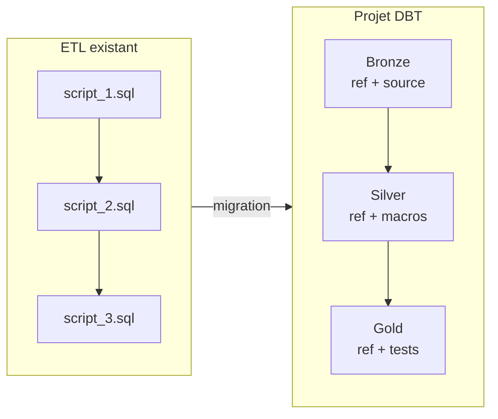

# Scénario de migration : ETL Full SQL Hive → DBT

Ce document guide la migration d'un ETL existant en SQL Hive pur vers un projet
DBT structuré en architecture médaillon, en utilisant ce sandbox comme point de départ.

---

## Table des matières

- [Vue d'ensemble](#vue-densemble)
- [Phase 1 – Audit de l'ETL existant](#phase-1--audit-de-letl-existant)
- [Phase 2 – Conception de l'architecture cible](#phase-2--conception-de-larchitecture-cible)
- [Phase 3 – Initialisation du projet DBT](#phase-3--initialisation-du-projet-dbt)
- [Phase 4 – Migration des scripts SQL](#phase-4--migration-des-scripts-sql)
- [Phase 5 – Validation en parallèle](#phase-5--validation-en-parallèle)
- [Phase 6 – Bascule en production](#phase-6--bascule-en-production)
- [Checklist de migration](#checklist-de-migration)
- [Anti-patterns courants](#anti-patterns-courants)

---

## Vue d'ensemble



La migration se fait **script par script**, en commençant par les sources et en
remontant vers les agrégats. À chaque étape, les résultats DBT sont comparés aux
résultats de l'ETL existant avant de passer à l'étape suivante.

**Durée estimée** : 1 à 3 jours par couche selon la complexité des scripts.

---

## Phase 1 – Audit de l'ETL existant

Avant de toucher au code, cartographier ce qui existe.

### 1.1 Inventaire des scripts

Pour chaque script SQL, remplir ce tableau :

| Script | Table source(s) | Table cible | Type de charge | Fréquence | Propriétaire |
|---|---|---|---|---|---|
| `load_commandes.sql` | `raw.commandes` | `dw.fact_commandes` | Incrémentiel | Quotidien | ? |
| `agg_ventes.sql` | `dw.fact_commandes` | `dw.kpi_ventes` | Full | Quotidien | ? |

### 1.2 Cartographier les dépendances

Identifier l'ordre d'exécution et les dépendances entre scripts. Si un ordonnanceur
(Airflow, Oozie, cron) est en place, extraire le DAG existant.

**Questions clés à répondre :**
- [ ] Quels scripts doivent tourner avant les autres ?
- [ ] Y a-t-il des tables intermédiaires sans usage final (candidats à la suppression) ?
- [ ] Y a-t-il des scripts qui lisent ET écrivent dans la même base ?
- [ ] Certaines tables sont-elles alimentées par plusieurs scripts ?

### 1.3 Identifier les patterns d'incrémentalité

Pour chaque script de type incrémentiel, noter :

```
- Colonne de filtre temporel : updated_at ? date_partition ? id_max ?
- Stratégie : INSERT OVERWRITE partition ? INSERT INTO ? DELETE + INSERT ?
- Gestion des arrivées tardives : lookback ? fenêtre fixe ?
- Logique de dédoublonnage : présente ? absente ? où ?
```

### 1.4 Documenter les règles métier critiques

Extraire les règles métier enfouies dans le SQL et les noter en langage naturel
avant de les recoder en DBT. Elles serviront à écrire les tests de validation.

**Exemples de règles à capturer :**
- "Une commande avec `montant_ht IS NULL` est exclue du calcul du CA"
- "Le statut `ANNULE` après `LIVRE` est impossible — traité comme une erreur source"
- "Les clients sans commande depuis 12 mois sont exclus des KPI"

---

## Phase 2 – Conception de l'architecture cible

### 2.1 Mapper les scripts vers les couches médaillon

| Script existant | Couche DBT cible | Justification |
|---|---|---|
| Scripts d'ingestion brute | **Bronze** | Copie source, pas de logique métier |
| Scripts de nettoyage, dédup, jointures référentiel | **Silver** | Transformation et validation |
| Scripts d'agrégation, calcul de KPIs | **Gold** | Produits métier consommables |

**Règle de décision :**
- Le script **copie ou filtre** sans transformer → Bronze
- Le script **nettoie, dédoublonne, enrichit, rejette** → Silver
- Le script **agrège, pivote, calcule des métriques** → Gold

### 2.2 Identifier les tables sources à déclarer

Toute table lue depuis une base externe au projet DBT doit devenir une `source`
dans `_sources.yml`. Ne jamais utiliser un nom de table en dur dans un modèle DBT.

```yaml
# À créer dans models/bronze/_sources.yml
sources:
  - name: raw
    database: ma_base_source
    tables:
      - name: commandes   # ← chaque table source devient une entrée
      - name: clients
```

### 2.3 Décider des conventions de nommage

Adopter dès le début une convention et s'y tenir :

| Couche | Préfixe | Exemple |
|---|---|---|
| Bronze | `brz_` | `brz_commandes` |
| Silver | `slv_` | `slv_commandes` |
| Gold | `gld_` | `gld_commandes_par_jour` |
| Seeds | `ref_` | `ref_statuts_commande` |

---

## Phase 3 – Initialisation du projet DBT

### 3.1 Cloner ce sandbox et adapter la configuration

```bash
git clone <url-sandbox>
cd DBT-sandbox

# Adapter le nom du projet
# dbt_project.yml → champ "name"

# Configurer la connexion Hive
cp profiles.example.yml ~/.dbt/profiles.yml
# Éditer avec les paramètres du cluster cible

# Vérifier la connexion
dbt debug
```

### 3.2 Ajuster les variables globales

Dans `dbt_project.yml`, adapter les variables au contexte du client :

```yaml
vars:
  incremental_lookback_days: 3   # augmenter si les sources ont des arrivées tardives
  bronze_schema: 'bronze'        # adapter aux conventions de nommage existantes
  silver_schema: 'silver'
  gold_schema:   'gold'
```

### 3.3 Vérifier les schémas Hive cibles

S'assurer que les bases de données Hive cibles existent ou peuvent être créées :

```sql
-- Exécuter via Beeline avant le premier dbt run
CREATE DATABASE IF NOT EXISTS dev_sandbox_bronze;
CREATE DATABASE IF NOT EXISTS dev_sandbox_silver;
CREATE DATABASE IF NOT EXISTS dev_sandbox_gold;
CREATE DATABASE IF NOT EXISTS dev_sandbox_referentiel;
```

---

## Phase 4 – Migration des scripts SQL

Migrer **couche par couche**, dans l'ordre Bronze → Silver → Gold. Ne pas commencer
Silver avant que Bronze soit validé.

### 4.1 Règles de conversion

**Remplacer les noms de tables en dur par des `ref()` et `source()` :**

```sql
-- AVANT (SQL brut)
SELECT * FROM raw.commandes WHERE updated_at >= '2024-01-01';

-- APRÈS (DBT)
SELECT * FROM {{ source('raw', 'commandes') }}
WHERE {{ incremental_partition_predicate('updated_at') }}
```

**Remplacer la logique incrémentielle maison par les macros du sandbox :**

```sql
-- AVANT : logique incrémentielle codée à la main
WHERE updated_at >= (SELECT MAX(updated_at) FROM dw.fact_commandes)

-- APRÈS : macro réutilisable
WHERE {{ incremental_partition_predicate('updated_at') }}
```

**Remplacer les colonnes de partition codées en dur :**

```sql
-- AVANT
SELECT *, YEAR(updated_at) AS annee, MONTH(updated_at) AS mois, DAY(updated_at) AS jour

-- APRÈS
SELECT *, {{ date_partition_cols('updated_at') }}
```

**Remplacer les logiques de déduplication répétées :**

```sql
-- AVANT
SELECT * FROM (
  SELECT *, ROW_NUMBER() OVER (PARTITION BY id ORDER BY updated_at DESC) AS rn
  FROM source
) t WHERE rn = 1

-- APRÈS
{{ deduplicate('source', ['id'], 'updated_at') }}
```

### 4.2 Contrôles à effectuer modèle par modèle

Après chaque modèle migré, avant de passer au suivant :

- [ ] `dbt compile --select nom_du_modele` : le SQL compilé est-il syntaxiquement correct ?
- [ ] `dbt run --select nom_du_modele --full-refresh` : le modèle tourne-t-il sans erreur ?
- [ ] Comparer le nombre de lignes avec la table existante (voir section 5.1)
- [ ] `dbt test --select nom_du_modele` : tous les tests passent-ils ?

### 4.3 Gérer les cas particuliers Hive

**Fonctions Hive non supportées par dbt-hive :**
Certaines fonctions spécifiques au dialecte Hive (ex. `DISTRIBUTE BY`, `SORT BY`,
`CLUSTER BY`) ne peuvent pas être utilisées dans un modèle DBT standard. Les
encapsuler dans une macro `` ou les documenter comme
limitation connue.

**Tables non-partitionnées dans l'ETL existant :**
Si l'ETL existant écrit dans des tables non partitionnées, ajouter le partitionnement
progressivement en Silver/Gold. Ne pas forcer le partitionnement en Bronze si la
source ne l'est pas — aligner d'abord, optimiser ensuite.

**INSERT OVERWRITE vs MERGE :**
Hive ne supporte pas `MERGE`. Si l'ETL existant utilise des patterns `DELETE + INSERT`
ou `MERGE` (via Spark), remplacer par `insert_overwrite` + `ROW_NUMBER` de déduplication
comme modélisé dans ce sandbox.

---

### 4.4 Hive non-ACID : le piège du partitionnement Silver

C'est le point le plus critique de toute migration ETL vers DBT sur Hive non-ACID.
**Ne pas l'ignorer** — il produit des duplicats silencieux difficiles à détecter.

#### Le problème

Le `INSERT OVERWRITE` dynamique Hive n'écrase **que les partitions présentes dans
le résultat**. Les autres partitions sont intactes. C'est un comportement correct
pour Bronze (raw zone, multi-versions acceptées), mais fatal pour Silver si on
partitionne par `updated_at`.

```
Commande #123 — créée le 15 Jan, modifiée le 1 Mars

Run Silver incrémentiel du 1 Mars :
  → filtre updated_at >= 27 Fev
  → traite la commande #123 (updated_at = 1 Mars)
  → INSERT OVERWRITE partition Silver 2024/03/01  ✓ (nouvelle version)
  → partition Silver 2024/01/15 : INTACTE         ✗ (ancienne version toujours là)

Résultat : id_commande=123 dans deux partitions Silver → test unique ÉCHOUE
```

#### La règle

> **Bronze** : partitionner par `updated_at` (raw, toutes versions OK)
>
> **Silver** : partitionner par une **date métier stable et immuable**
> (`date_commande`, `date_creation`…) qui ne change jamais après la création
> de l'enregistrement

#### La solution implémentée dans ce sandbox

La macro `load_affected_business_partitions` dans `macros/incremental_utils.sql`
gère cette contrainte en trois étapes :

```
Étape 1 — Détection (filtre sur updated_at) :
  Quelles date_commande contiennent des lignes modifiées récemment ?
  → date_commande = 15 Jan (commande #123 modifiée le 1 Mars)

Étape 2 — Rechargement complet des partitions métier impactées :
  Charger TOUTES les lignes Bronze avec date_commande = 15 Jan
  (pas seulement celles dont updated_at >= borne, mais TOUTES)

Étape 3 — Déduplication puis INSERT OVERWRITE :
  ROW_NUMBER sur id_commande → garde la version la plus récente
  INSERT OVERWRITE partition Silver date_commande=15 Jan
  → remplace ENTIÈREMENT la partition → zéro doublon
```

Usage dans un modèle Silver :

```sql
{{ config(partition_by=['annee', 'mois', 'jour']) }}

WITH brz AS (
  {{ load_affected_business_partitions(
      ref('brz_commandes'),
      ts_column        = 'updated_at',
      business_date_col= 'date_commande'   -- doit être immuable dans la source
  ) }}
),
dedup AS (
  {{ deduplicate('brz', ['id_commande'], 'updated_at') }}
)
SELECT
  *,
  {{ date_partition_cols('date_commande') }}  -- partition par date stable, PAS updated_at
FROM dedup
```

#### Prérequis côté source

Pour appliquer ce pattern, la source doit exposer une **date métier immuable**.
Lors de l'audit (Phase 1), vérifier pour chaque entité :

| Entité | Date métier stable candidate | Immuable ? |
|---|---|---|
| Commande | `date_commande`, `date_creation` | Oui si jamais rétromodifiée |
| Client | `date_inscription` | Oui |
| Facture | `date_facture` | Oui |
| Événement | `event_timestamp` | Oui (passé immuable) |

Si **aucune date stable n'existe** dans la source (cas rare mais possible), les
alternatives sont, par ordre de préférence :

1. Ajouter une `date_creation` côté source et la propager — solution pérenne
2. Utiliser `DATE(MIN(updated_at) OVER (PARTITION BY id))` comme approximation
   de la date de création — à valider avec le métier
3. Faire un `--full-refresh` quotidien de Silver — simple mais coûteux sur
   de gros volumes

#### Paramètre Hive à vérifier

La macro repose sur le partitionnement dynamique Hive. Vérifier que ces
propriétés sont activées sur le cluster avant le premier run :

```sql
-- À vérifier via Beeline / HiveServer2
SET hive.exec.dynamic.partition       = true;
SET hive.exec.dynamic.partition.mode  = nonstrict;
SET hive.exec.max.dynamic.partitions  = 10000;   -- ajuster si volume élevé
```

---

## Phase 5 – Validation en parallèle

**Ne jamais couper l'ETL existant avant cette phase.** Faire tourner les deux
pipelines en parallèle pendant au minimum **5 jours ouvrés** (pour couvrir
les variations hebdomadaires).

### 5.1 Requêtes de contrôle de volumétrie

```sql
-- Comparer les volumes entre l'ancienne table et le nouveau modèle DBT
SELECT
  'ETL existant'  AS source,
  COUNT(*)        AS nb_lignes,
  COUNT(DISTINCT id_commande) AS nb_cles
FROM ancienne_base.fact_commandes
WHERE date_partition = CURRENT_DATE()

UNION ALL

SELECT
  'DBT Silver'    AS source,
  COUNT(*)        AS nb_lignes,
  COUNT(DISTINCT id_commande) AS nb_cles
FROM dev_sandbox_silver.slv_commandes
WHERE annee = YEAR(CURRENT_DATE())
  AND mois  = MONTH(CURRENT_DATE())
  AND jour  = DAY(CURRENT_DATE());
```

### 5.2 Contrôle des agrégats métier

```sql
-- Comparer les KPIs Gold vs les agrégats de l'ETL existant
SELECT
  t1.date_ref,
  t1.ca_ht_etl,
  t2.ca_ht_dbt,
  ABS(t1.ca_ht_etl - t2.ca_ht_dbt)           AS ecart_absolu,
  ROUND(
    ABS(t1.ca_ht_etl - t2.ca_ht_dbt)
    / NULLIF(t1.ca_ht_etl, 0) * 100, 4
  )                                            AS ecart_pct
FROM (
  SELECT date_ref, SUM(ca_ht) AS ca_ht_etl
  FROM ancienne_base.kpi_ventes GROUP BY date_ref
) t1
JOIN (
  SELECT date_commande AS date_ref, ca_ht_total AS ca_ht_dbt
  FROM dev_sandbox_gold.gld_commandes_par_jour
) t2 ON t1.date_ref = t2.date_ref
WHERE ecart_pct > 0.01   -- alerter si écart > 0.01 %
ORDER BY ecart_pct DESC;
```

### 5.3 Seuils d'acceptation

| Indicateur | Seuil acceptable | Action si dépassé |
|---|---|---|
| Écart volumétrie Bronze | 0 % | Bloquer — la source doit être identique |
| Écart volumétrie Silver | < 0.5 % | Investiguer les rejets supplémentaires |
| Écart CA journalier Gold | < 0.01 % | Investiguer les différences d'arrondis ou de dédup |
| Écart nombre de clients distincts | 0 % | Bloquer — même référentiel |

### 5.4 Utiliser les tests de volumétrie du sandbox

Les tests `taux_rejet_max`, `cles_orphelines` et `couverture_agregat` déjà configurés
dans les `_schema.yml` servent de filet de sécurité permanent. Les faire tourner
quotidiennement pendant la phase de parallélisation :

```bash
dbt test --select tag:silver tag:gold
```

---

## Phase 6 – Bascule en production

### 6.1 Prérequis avant bascule

- [ ] 5 jours de run en parallèle sans écart dépassant les seuils
- [ ] Tous les tests `dbt test` passent en prod
- [ ] `dbt docs generate --target prod` : documentation à jour
- [ ] Les consommateurs (dashboards, APIs) ont été testés sur les tables DBT
- [ ] Le plan de rollback est documenté (comment re-basculer sur l'ETL existant)
- [ ] L'ordonnanceur (Airflow, Oozie, cron) est configuré pour lancer `dbt build`

### 6.2 Ordre de bascule recommandé

```
1. Basculer Bronze  → valider 2 jours
2. Basculer Silver  → valider 2 jours
3. Basculer Gold    → valider 2 jours
4. Rediriger les consommateurs vers les tables DBT
5. Archiver les anciens scripts SQL (ne pas supprimer immédiatement)
6. Supprimer les anciennes tables J+30 après validation définitive
```

### 6.3 Commande de run en production

```bash
# Run complet avec cible prod
dbt build --target prod

# En cas d'incident : full-refresh d'une couche
dbt run --target prod --select tag:silver --full-refresh
```

### 6.4 Rollback

En cas de problème bloquant après bascule :

```bash
# 1. Re-activer l'ETL existant dans l'ordonnanceur
# 2. Pointer les consommateurs vers les anciennes tables
# 3. Ouvrir un incident avec les écarts constatés
# 4. Ne pas supprimer les tables DBT — elles servent au diagnostic
```

---

## Checklist de migration

### Phase 1 – Audit
- [ ] Inventaire complet des scripts avec table source/cible
- [ ] DAG de dépendances cartographié
- [ ] Patterns d'incrémentalité documentés pour chaque script
- [ ] Règles métier critiques extraites en langage naturel

### Phase 2 – Conception
- [ ] Chaque script mappé vers une couche Bronze/Silver/Gold
- [ ] Tables sources identifiées pour `_sources.yml`
- [ ] Convention de nommage décidée et documentée
- [ ] Bases de données Hive cibles créées

### Phase 3 – Init
- [ ] Sandbox cloné et renommé
- [ ] `profiles.example.yml` copié et configuré
- [ ] `dbt debug` passe sans erreur
- [ ] `dbt deps` installé

### Phase 4 – Migration
- [ ] Bronze : tous les scripts migrés, compilés, testés
- [ ] Silver : tous les scripts migrés, compilés, testés
- [ ] Gold : tous les scripts migrés, compilés, testés
- [ ] Seeds : référentiels chargés via `dbt seed`
- [ ] Macros maison ajoutées dans `macros/` si besoin

### Phase 5 – Validation
- [ ] 5 jours de run en parallèle
- [ ] Écarts volumétrie dans les seuils acceptés
- [ ] Écarts agrégats Gold dans les seuils acceptés
- [ ] `dbt test` 100 % vert en environnement de prod

### Phase 6 – Bascule
- [ ] Ordonnanceur configuré sur `dbt build`
- [ ] Consommateurs redirigés vers tables DBT
- [ ] Anciens scripts archivés
- [ ] Documentation `dbt docs generate` publiée

---

## Anti-patterns courants

| Anti-pattern | Problème | Solution |
|---|---|---|
| Garder des noms de tables en dur (`raw.commandes`) | Casse si la base est renommée, invisible dans le lineage | Toujours utiliser `source()` ou `ref()` |
| Recoder la logique incrémentielle dans chaque modèle | Incohérence entre modèles, maintenance difficile | Utiliser `incremental_partition_predicate()` |
| Migrer Gold avant Silver | Impossible de valider les agrégats sans Silver stable | Toujours migrer Bronze → Silver → Gold dans l'ordre |
| Supprimer l'ETL existant avant validation | Pas de filet en cas d'écart | Garder l'ETL au minimum 5 jours après bascule |
| Mettre toute la logique dans un seul modèle Gold | Lineage opaque, tests impossibles, debug difficile | Respecter la séparation des couches |
| Ignorer les arrivées tardives | Partitions incomplètes silencieuses | Configurer `incremental_lookback_days` ≥ 3 |
