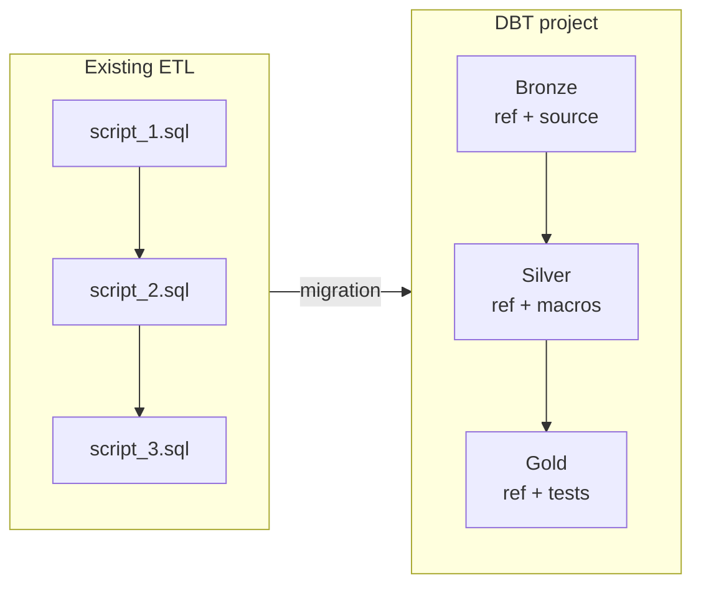

# Migration scenario: Full SQL Hive ETL → DBT

This document guides the migration of an existing pure Hive SQL ETL to a DBT project
structured around a medallion architecture, using this sandbox as a starting point.

---

## Table of contents

- [Overview](#overview)
- [Phase 1 – Audit the existing ETL](#phase-1--audit-the-existing-etl)
- [Phase 2 – Design the target architecture](#phase-2--design-the-target-architecture)
- [Phase 3 – Initialise the DBT project](#phase-3--initialise-the-dbt-project)
- [Phase 4 – Migrate SQL scripts](#phase-4--migrate-sql-scripts)
- [Phase 5 – Parallel validation](#phase-5--parallel-validation)
- [Phase 6 – Production cutover](#phase-6--production-cutover)
- [Migration checklist](#migration-checklist)
- [Common anti-patterns](#common-anti-patterns)

---

## Overview



Migration happens **script by script**, starting from sources and working up towards
aggregates. At each step, DBT results are compared to the existing ETL results before
moving on.

**Estimated duration**: 1 to 3 days per layer depending on script complexity.

---

## Phase 1 – Audit the existing ETL

Before touching any code, map what already exists.

### 1.1 Script inventory

For each SQL script, fill in this table:

| Script | Source table(s) | Target table | Load type | Frequency | Owner |
|---|---|---|---|---|---|
| `load_orders.sql` | `raw.orders` | `dw.fact_orders` | Incremental | Daily | ? |
| `agg_sales.sql` | `dw.fact_orders` | `dw.kpi_sales` | Full | Daily | ? |

### 1.2 Map dependencies

Identify the execution order and dependencies between scripts. If a scheduler
(Airflow, Oozie, cron) is in place, extract the existing DAG.

**Key questions to answer:**
- [ ] Which scripts must run before others?
- [ ] Are there intermediate tables with no downstream usage (candidates for removal)?
- [ ] Are there scripts that both read AND write to the same database?
- [ ] Are any tables fed by multiple scripts?

### 1.3 Identify incrementality patterns

For each incremental script, note:

```
- Temporal filter column: updated_at? date_partition? max_id?
- Strategy: INSERT OVERWRITE partition? INSERT INTO? DELETE + INSERT?
- Late arrival handling: lookback? fixed window?
- Deduplication logic: present? absent? where?
```

### 1.4 Document critical business rules

Extract business rules buried in SQL and write them in plain language before
re-coding them in DBT. They will be used to write validation tests.

**Examples of rules to capture:**
- "An order with `amount_excl_tax IS NULL` is excluded from revenue calculations"
- "Status `CANCELLED` after `DELIVERED` is impossible — treated as a source error"
- "Clients with no orders in the last 12 months are excluded from KPIs"

---

## Phase 2 – Design the target architecture

### 2.1 Map scripts to medallion layers

| Existing script | Target DBT layer | Justification |
|---|---|---|
| Raw ingestion scripts | **Bronze** | Source copy, no business logic |
| Cleansing, dedup, reference joins | **Silver** | Transformation and validation |
| Aggregation, KPI calculation | **Gold** | Consumable business products |

**Decision rule:**
- Script **copies or filters** without transforming → Bronze
- Script **cleans, deduplicates, enriches, rejects** → Silver
- Script **aggregates, pivots, computes metrics** → Gold

### 2.2 Identify source tables to declare

Any table read from a database external to the DBT project must become a `source`
in `_sources.yml`. Never use a hardcoded table name in a DBT model.

```yaml
# To create in models/bronze/_sources.yml
sources:
  - name: raw
    database: my_source_db
    tables:
      - name: orders    # ← each source table becomes an entry
      - name: clients
```

### 2.3 Decide on naming conventions

Adopt a convention from the start and stick to it:

| Layer | Prefix | Example |
|---|---|---|
| Bronze | `brz_` | `brz_commandes` |
| Silver | `slv_` | `slv_commandes` |
| Gold | `gld_` | `gld_commandes_par_jour` |
| Seeds | `ref_` | `ref_statuts_commande` |

---

## Phase 3 – Initialise the DBT project

### 3.1 Clone this sandbox and adapt the configuration

```bash
git clone <sandbox-url>
cd DBT-sandbox

# Adapt the project name
# dbt_project.yml → "name" field

# Configure the Hive connection
cp profiles.example.yml ~/.dbt/profiles.yml
# Edit with the target cluster parameters

# Verify the connection
dbt debug
```

### 3.2 Adjust global variables

In `dbt_project.yml`, adapt the variables to the client context:

```yaml
vars:
  incremental_lookback_days: 3   # increase if sources have late arrivals
  bronze_schema: 'bronze'        # adapt to existing naming conventions
  silver_schema: 'silver'
  gold_schema:   'gold'
```

### 3.3 Verify target Hive schemas

Ensure the target Hive databases exist or can be created:

```sql
-- Run via Beeline before the first dbt run
CREATE DATABASE IF NOT EXISTS dev_sandbox_bronze;
CREATE DATABASE IF NOT EXISTS dev_sandbox_silver;
CREATE DATABASE IF NOT EXISTS dev_sandbox_gold;
CREATE DATABASE IF NOT EXISTS dev_sandbox_referentiel;
```

---

## Phase 4 – Migrate SQL scripts

Migrate **layer by layer**, in order Bronze → Silver → Gold. Do not start
Silver until Bronze is validated.

### 4.1 Conversion rules

**Replace hardcoded table names with `ref()` and `source()`:**

```sql
-- BEFORE (raw SQL)
SELECT * FROM raw.orders WHERE updated_at >= '2024-01-01';

-- AFTER (DBT)
SELECT * FROM {{ source('raw', 'orders') }}
WHERE {{ incremental_partition_predicate('updated_at') }}
```

**Replace hand-coded incremental logic with sandbox macros:**

```sql
-- BEFORE: manual incremental logic
WHERE updated_at >= (SELECT MAX(updated_at) FROM dw.fact_orders)

-- AFTER: reusable macro
WHERE {{ incremental_partition_predicate('updated_at') }}
```

**Replace hardcoded partition columns:**

```sql
-- BEFORE
SELECT *, YEAR(updated_at) AS annee, MONTH(updated_at) AS mois, DAY(updated_at) AS jour

-- AFTER
SELECT *, {{ date_partition_cols('updated_at') }}
```

**Replace repeated deduplication logic:**

```sql
-- BEFORE
SELECT * FROM (
  SELECT *, ROW_NUMBER() OVER (PARTITION BY id ORDER BY updated_at DESC) AS rn
  FROM source
) t WHERE rn = 1

-- AFTER
{{ deduplicate('source', ['id'], 'updated_at') }}
```

### 4.2 Per-model controls

After each migrated model, before moving to the next:

- [ ] `dbt compile --select model_name`: is the compiled SQL syntactically correct?
- [ ] `dbt run --select model_name --full-refresh`: does the model run without error?
- [ ] Compare row counts against the existing table (see section 5.1)
- [ ] `dbt test --select model_name`: do all tests pass?

### 4.3 Hive-specific edge cases

**Hive functions unsupported by dbt-hive:**
Certain Hive-dialect functions (e.g. `DISTRIBUTE BY`, `SORT BY`, `CLUSTER BY`)
cannot be used in a standard DBT model. Encapsulate them in a
`` macro or document them as known limitations.

**Non-partitioned tables in the existing ETL:**
If the existing ETL writes to non-partitioned tables, add partitioning
progressively in Silver/Gold. Do not force partitioning in Bronze if the
source is not partitioned — align first, optimise later.

**INSERT OVERWRITE vs MERGE:**
Hive does not support `MERGE`. If the existing ETL uses `DELETE + INSERT`
or `MERGE` patterns (via Spark), replace with `insert_overwrite` + `ROW_NUMBER`
deduplication as modelled in this sandbox.

---

### 4.4 Non-ACID Hive: the Silver partitioning trap

This is the most critical point of any ETL-to-DBT migration on non-ACID Hive.
**Do not ignore it** — it produces silent duplicates that are hard to detect.

#### The problem

Hive dynamic `INSERT OVERWRITE` only overwrites **partitions present in the
result set**. All other partitions remain untouched. This is correct for
Bronze (raw zone, multi-version accepted), but dangerous for Silver if
partitioned by `updated_at`.

```
Order #123 — created 15 Jan, modified 1 Mar

Silver incremental run on 1 Mar:
  → filters updated_at >= 27 Feb
  → processes order #123 (updated_at = 1 Mar)
  → INSERT OVERWRITE Silver partition 2024/03/01  ✓ (new version)
  → Silver partition 2024/01/15: UNTOUCHED        ✗ (old version still there)

Result: id_commande=123 in two Silver partitions → unique test FAILS
```

#### The rule

> **Bronze**: partition by `updated_at` (raw, all versions OK)
>
> **Silver**: either partition by a **stable, immutable business date**
> (`order_date`, `creation_date`…) that never changes after record creation,
> OR accept multi-version Silver and handle deduplication in Gold.

#### This sandbox's approach

Silver is intentionally **multi-version** (partitioned by `updated_at`), because:
- Updates touch orders up to 3 years old, scattered across many partitions
- Rewriting business-date partitions would be prohibitively expensive

**Consequence**: `id_commande` is unique *within* each partition, but not globally.
Every Gold model **must** start with an inter-partition deduplication CTE:

```sql
WITH slv_dedup AS (
  -- Mandatory: Silver is multi-version. Keep only the most recent version
  -- per order before aggregating, otherwise amounts and counts will be wrong.
  {{ deduplicate(ref('slv_commandes'), ['id_commande'], 'updated_at') }}
)
```

#### Alternative: partition by stable business date

If updates are temporally local (recent updates only affect recent records)
AND a stable business date exists in the source, use
`load_affected_business_partitions()` from `macros/incremental_utils.sql`:

```sql
{{ config(partition_by=['annee', 'mois', 'jour']) }}

WITH brz AS (
  {{ load_affected_business_partitions(
      ref('brz_commandes'),
      ts_column        = 'updated_at',
      business_date_col= 'order_date'   -- must be immutable in the source
  ) }}
),
dedup AS (
  {{ deduplicate('brz', ['id_commande'], 'updated_at') }}
)
SELECT
  *,
  {{ date_partition_cols('order_date') }}  -- partition by stable date, NOT updated_at
FROM dedup
```

#### Hive settings to verify

```sql
-- Check via Beeline / HiveServer2
SET hive.exec.dynamic.partition       = true;
SET hive.exec.dynamic.partition.mode  = nonstrict;
SET hive.exec.max.dynamic.partitions  = 10000;   -- adjust for high volumes
```

---

## Phase 5 – Parallel validation

**Never shut down the existing ETL before this phase.** Run both pipelines in
parallel for a minimum of **5 business days** (to cover weekly variations).

### 5.1 Volumetry control queries

```sql
-- Compare volumes between the old table and the new DBT model
SELECT
  'Existing ETL'  AS source,
  COUNT(*)        AS row_count,
  COUNT(DISTINCT id_commande) AS distinct_keys
FROM old_db.fact_orders
WHERE date_partition = CURRENT_DATE()

UNION ALL

SELECT
  'DBT Silver'    AS source,
  COUNT(*)        AS row_count,
  COUNT(DISTINCT id_commande) AS distinct_keys
FROM dev_sandbox_silver.slv_commandes
WHERE annee = YEAR(CURRENT_DATE())
  AND mois  = MONTH(CURRENT_DATE())
  AND jour  = DAY(CURRENT_DATE());
```

### 5.2 Business aggregate control

```sql
-- Compare Gold KPIs vs existing ETL aggregates
SELECT
  t1.date_ref,
  t1.revenue_etl,
  t2.revenue_dbt,
  ABS(t1.revenue_etl - t2.revenue_dbt)              AS absolute_gap,
  ROUND(
    ABS(t1.revenue_etl - t2.revenue_dbt)
    / NULLIF(t1.revenue_etl, 0) * 100, 4
  )                                                  AS gap_pct
FROM (
  SELECT date_ref, SUM(revenue) AS revenue_etl
  FROM old_db.kpi_sales GROUP BY date_ref
) t1
JOIN (
  SELECT date_commande AS date_ref, ca_ht_total AS revenue_dbt
  FROM dev_sandbox_gold.gld_commandes_par_jour
) t2 ON t1.date_ref = t2.date_ref
WHERE gap_pct > 0.01   -- alert if gap > 0.01%
ORDER BY gap_pct DESC;
```

### 5.3 Acceptance thresholds

| Indicator | Acceptable threshold | Action if exceeded |
|---|---|---|
| Bronze volumetry gap | 0% | Block — source must be identical |
| Silver volumetry gap | < 0.5% | Investigate additional rejections |
| Daily Gold revenue gap | < 0.01% | Investigate rounding or dedup differences |
| Distinct client count gap | 0% | Block — same reference data |

### 5.4 Use sandbox volumetry tests

The `taux_rejet_max`, `cles_orphelines` and `couverture_agregat` tests already
configured in `_schema.yml` serve as a permanent safety net. Run them daily
during the parallel phase:

```bash
dbt test --select tag:silver tag:gold
```

---

## Phase 6 – Production cutover

### 6.1 Pre-cutover prerequisites

- [ ] 5 days of parallel runs with no gap exceeding thresholds
- [ ] All `dbt test` pass in prod
- [ ] `dbt docs generate --target prod`: documentation up to date
- [ ] Consumers (dashboards, APIs) tested against DBT tables
- [ ] Rollback plan documented (how to switch back to the existing ETL)
- [ ] Scheduler (Airflow, Oozie, cron) configured to run `dbt build`

### 6.2 Recommended cutover order

```
1. Cut over Bronze  → validate 2 days
2. Cut over Silver  → validate 2 days
3. Cut over Gold    → validate 2 days
4. Redirect consumers to DBT tables
5. Archive old SQL scripts (do not delete immediately)
6. Drop old tables D+30 after final validation
```

### 6.3 Production run command

```bash
# Full run on prod target
dbt build --target prod

# In case of incident: full-refresh of a layer
dbt run --target prod --select tag:silver --full-refresh
```

### 6.4 Rollback

In case of a blocking issue after cutover:

```bash
# 1. Re-enable the existing ETL in the scheduler
# 2. Point consumers back to the old tables
# 3. Open an incident with the observed gaps
# 4. Do not drop DBT tables — they are needed for diagnosis
```

---

## Migration checklist

### Phase 1 – Audit
- [ ] Complete script inventory with source/target tables
- [ ] Dependency DAG mapped
- [ ] Incrementality patterns documented for each script
- [ ] Critical business rules extracted in plain language

### Phase 2 – Design
- [ ] Each script mapped to a Bronze/Silver/Gold layer
- [ ] Source tables identified for `_sources.yml`
- [ ] Naming convention decided and documented
- [ ] Target Hive databases created

### Phase 3 – Init
- [ ] Sandbox cloned and renamed
- [ ] `profiles.example.yml` copied and configured
- [ ] `dbt debug` passes without error
- [ ] `dbt deps` installed

### Phase 4 – Migration
- [ ] Bronze: all scripts migrated, compiled, tested
- [ ] Silver: all scripts migrated, compiled, tested
- [ ] Gold: all scripts migrated, compiled, tested
- [ ] Seeds: reference tables loaded via `dbt seed`
- [ ] Custom macros added to `macros/` as needed

### Phase 5 – Validation
- [ ] 5 days of parallel runs
- [ ] Volumetry gaps within accepted thresholds
- [ ] Gold aggregate gaps within accepted thresholds
- [ ] `dbt test` 100% green in prod environment

### Phase 6 – Cutover
- [ ] Scheduler configured on `dbt build`
- [ ] Consumers redirected to DBT tables
- [ ] Old scripts archived
- [ ] `dbt docs generate` documentation published

---

## Common anti-patterns

| Anti-pattern | Problem | Solution |
|---|---|---|
| Keeping hardcoded table names (`raw.orders`) | Breaks if database is renamed, invisible in lineage | Always use `source()` or `ref()` |
| Hand-coding incremental logic in every model | Inconsistency between models, hard to maintain | Use `incremental_partition_predicate()` |
| Migrating Gold before Silver | Cannot validate aggregates without stable Silver | Always migrate Bronze → Silver → Gold in order |
| Dropping the existing ETL before validation | No safety net if gaps appear | Keep the ETL for at least 5 days after cutover |
| Putting all logic in a single Gold model | Opaque lineage, impossible tests, hard debugging | Respect layer separation |
| Ignoring late arrivals | Silently incomplete partitions | Set `incremental_lookback_days` ≥ 3 |
| Aggregating Silver without deduplication | Wrong figures (multi-version Silver counted multiple times) | Always start Gold models with `deduplicate()` CTE |
